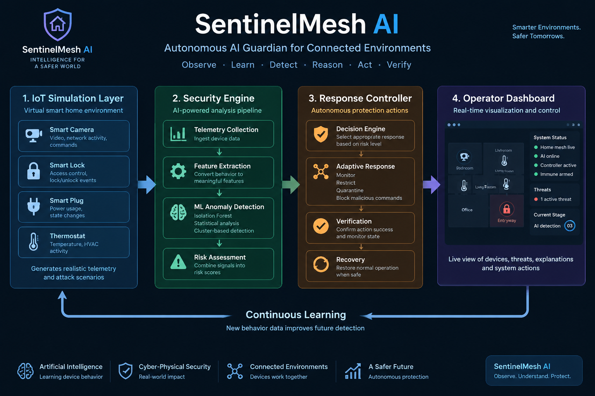

# SentinelMesh AI

## Autonomous AI Guardian for Connected Environments

> SentinelMesh AI is a cyber-physical intelligence layer that learns IoT device behavior, detects anomalies using machine learning, explains risks, and autonomously applies adaptive responses.

🎥 **Demo Video:** https://youtu.be/tHQ9lVPxPAY?si=LCI35CEFHrIKVXbQ

---

## Overview

The world is becoming increasingly connected. Smart cameras, locks, plugs, thermostats, and other IoT devices are becoming part of everyday life.

However, as these systems become more intelligent, they also become harder for humans to monitor. A compromised IoT device is no longer only a cybersecurity issue — it can create real-world physical risks.

SentinelMesh AI explores a future where connected environments can understand their own behavior, recognize abnormal activity, and respond autonomously.

Instead of relying only on predefined security rules, SentinelMesh creates behavioral profiles for devices, detects deviations using machine learning, explains the reasoning behind decisions, and applies adaptive defensive actions.

---

# Key Idea

Traditional security systems often follow:

```
Suspicious activity
        ↓
Alert
        ↓
Human investigation
```

SentinelMesh introduces an intelligent response loop:

```
Observe
   ↓
Learn
   ↓
Detect
   ↓
Reason
   ↓
Act
   ↓
Verify
```

The goal is to move from reactive security toward autonomous cyber-physical protection.

---

# Features

## 🧠 Behavioral Learning

Each connected device develops its own behavioral baseline.

Different devices have different patterns:

- A camera has communication and streaming behavior.
- A smart lock has access-control behavior.
- A smart plug has energy-consumption behavior.

SentinelMesh analyzes devices individually instead of applying one universal rule set.

---

## 🔍 Machine Learning Anomaly Detection

SentinelMesh combines multiple ML approaches to identify unusual behavior.

Implemented techniques:

- **Isolation Forest**
  - Detects unusual patterns compared with previous observations.

- **Statistical anomaly detection**
  - Measures deviation from learned device behavior.

- **Cluster-based behavior analysis**
  - Identifies activity that differs from normal behavior groups.

The system focuses on discovering behavioral changes rather than only matching known attack signatures.

---

## 📊 Risk Assessment

Detected anomalies are converted into understandable risk scores.

Example:

```
Unknown communication source
+
Abnormal traffic increase
+
Unauthorized command attempts

=
High-risk behavior
```

The system combines multiple signals to estimate the severity of a situation.

---

## 🤖 Adaptive Response

SentinelMesh does not stop at detection.

Depending on the risk level, devices can transition into different security states:

| Risk Level | Response |
|---|---|
| Low | Continue monitoring |
| Medium | Increase observation |
| High | Restricted mode |
| Critical | Quarantine |

The goal is to maintain safe operation while reducing potential damage.

---

## 🔗 Cross-Device Incident Correlation

IoT devices are not isolated.

A compromise of one device can affect another.

Example:

```
Smart Camera anomaly
        +
Unauthorized Smart Lock command
        =
Coordinated security incident
```

SentinelMesh analyzes relationships between devices to understand the wider environment.

---

# Architecture



```
                 IoT Simulator

                       ↓

              Telemetry Collection

                       ↓

              Feature Extraction

                       ↓

            ML Anomaly Detection

                       ↓

              Risk Assessment

                       ↓

            Response Policy Engine

                       ↓

          Safe Mode / Recovery Actions
```

---

# How It Works

## 1. IoT Simulation Layer

Because physical hardware was not available, SentinelMesh uses a simulated smart environment.

Simulated devices:

- Smart camera
- Smart plug
- Smart lock
- Smart thermostat

Each device generates telemetry:

- network activity;
- commands;
- power usage;
- sensor values;
- behavioral history.

---

## 2. AI Security Engine

The security engine processes telemetry through multiple stages:

### Feature Extraction

Raw device behavior is converted into measurable features:

- network activity;
- communication patterns;
- command frequency;
- power changes;
- sensor deviations.

### Anomaly Detection

ML models compare current behavior against learned patterns.

### Risk Analysis

The system combines detected signals into a security assessment.

### Response Decision

The system selects an appropriate defensive action.

---

# Demo Scenario

The demo shows a complete cyber-physical response cycle.

## Step 1 — Normal Environment

```
Smart Camera      🟢
Smart Lock        🟢
Smart Plug        🟢
Thermostat        🟢
```

The system learns normal device behavior.

---

## Step 2 — Coordinated Attack

A compromised device begins abnormal activity.

Detected signals:

```
✓ Unknown communication source
✓ Unusual traffic pattern
✓ Unauthorized commands
✓ Behavioral deviation
```

The system identifies a possible coordinated incident.

---

## Step 3 — AI Analysis

SentinelMesh provides evidence-based explanations:

```
Threat:
Possible device compromise

Evidence:

- Communication pattern changed
- Command behavior differs from baseline
- Risk level increased
```

---

## Step 4 — Autonomous Response

The system applies protection:

```
Threat detected

        ↓

Containment requested

        ↓

Device enters restricted mode

        ↓

Suspicious commands denied

        ↓

Response verified
```

---

# AI / ML Implementation

## Models

| Component | Purpose |
|---|---|
| Isolation Forest | Detect behavioral outliers |
| Statistical Analysis | Measure deviation from baseline |
| Cluster Analysis | Compare behavior groups |
| Risk Scoring | Combine multiple signals |

---

# Technology Stack

## Backend

- Python
- FastAPI
- Scikit-learn

## Frontend

- React
- TypeScript
- Tailwind CSS

## Machine Learning

- Isolation Forest
- Behavioral profiling
- Anomaly scoring

## Simulation

- Virtual IoT devices
- Telemetry generation
- Attack scenarios
- Response simulation

---

# Project Structure

```
SentinelMesh-AI/

├── dashboard/
│   └── React + TypeScript frontend
│
├── security_engine/
│   ├── anomaly detection
│   ├── risk scoring
│   ├── ML models
│   └── response engine
│
├── iot_simulator/
│   ├── virtual devices
│   ├── telemetry generation
│   └── attack scenarios
│
├── tests/
│
└── architecture.png
```

---

# Running Locally

## Requirements

- Python 3.10+
- Node.js

---

## 1. Start IoT Simulator

```bash
cd SentinelMesh-AI

IOT_SIM_HOST=127.0.0.1 .venv/bin/python -m iot_simulator
```

---

## 2. Start Security Engine

```bash
cd SentinelMesh-AI

ENGINE_HOST=127.0.0.1 .venv/bin/python -m security_engine
```

---

## 3. Start Dashboard

```bash
cd dashboard

npm install
npm run dev
```

Open:

```
http://127.0.0.1:5173
```

---

# AI Tools Disclosure

AI-assisted development tools were used during development.

I used Cursor as a development assistant for:

- implementation support;
- debugging;
- code organization;
- refactoring assistance.

The project architecture, system design, ML approach, problem definition, and final decisions were designed and evaluated by me.

---

# Challenges

The biggest challenge was creating a realistic intelligent environment without access to physical IoT hardware.

I had to simulate:

- realistic device behavior;
- normal variations;
- attack scenarios;
- physical consequences.

Another challenge was avoiding a simple rule-based security system.

The goal was to create a complete AI pipeline:

```
Behavior Observation
        ↓
Machine Learning Detection
        ↓
Risk Assessment
        ↓
Adaptive Response
```

---

# Future Improvements

Future versions could include:

- real IoT hardware integration;
- larger behavioral datasets;
- stronger autonomous AI agents;
- computer vision-based environment understanding;
- edge deployment;
- personalized security recommendations.

---

# Why I Built This

Technology should not only connect the world.

It should also help make it safer.

---

## SentinelMesh AI

**Observe. Understand. Protect.**

Autonomous AI for intelligent environments.
